# Habit Tracker Mermaid Diagrams

## 1. End-to-End Data Flow (System Architecture)

## 2. Sequence Diagram: Adding a Todo

## 3. Sequence Diagram: Toggling a Todo

## 4. Sequence Diagram: App Initialization (Load from Storage)

## 5. Sequence Diagram: Filtering Todos

## 6. Data Model & Relationships (ERD-style)

## 7. State Management Flow

## 8. Component Interaction Flow

```mermaid
graph LR
    subgraph "User Interface Layer"
        TodoForm[📝 TodoForm]
        TodoItem[☑️ TodoItem]
        TodoFilter[🔍 TodoFilter]
        TodoStats[📊 TodoStats]
    end

    subgraph "Container Layer"
        App[🎯 App.tsx]
    end

    subgraph "Logic Layer"
        Hook[⚙️ useTodos Hook]

        subgraph "Hook Internals"
            State[State Management]
            Effects[Side Effects]
            Callbacks[Operations]
        end
    end

    subgraph "Persistence Layer"
        Storage[💾 Storage Utils]
        LS[(localStorage)]
    end

    TodoForm -->|onAddTodo| App
    TodoItem -->|onToggle, onUpdate, onDelete| App
    TodoFilter -->|onFilterChange| App
    TodoStats -->|onClearCompleted, onToggleAll| App

    App -->|Uses| Hook
    Hook -->|Contains| State
    Hook -->|Contains| Effects
    Hook -->|Contains| Callbacks

    Effects -->|Read/Write| Storage
    Storage -->|Persist| LS

    Hook -->|Returns| App
    App -->|Props| TodoForm
    App -->|Props| TodoItem
    App -->|Props| TodoFilter
    App -->|Props| TodoStats

    style App fill:#f0e6ff
    style Hook fill:#ffe6f0
    style LS fill:#fff4e6
```

## 9. Complete CRUD Operations Flow

## How to View These Diagrams

1. **GitHub**: If you push this to GitHub, the diagrams will render automatically
2. **VS Code**: Install "Markdown Preview Mermaid Support" extension
3. **Online**: Copy the code blocks to https://mermaid.live/
4. **IDE**: Most modern IDEs support Mermaid rendering in markdown preview
